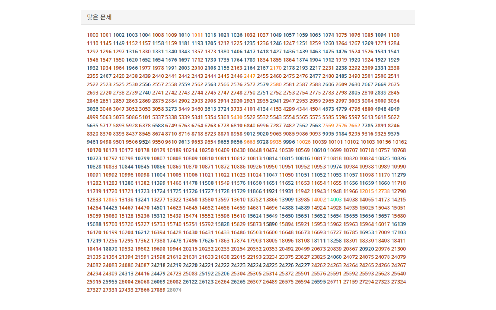
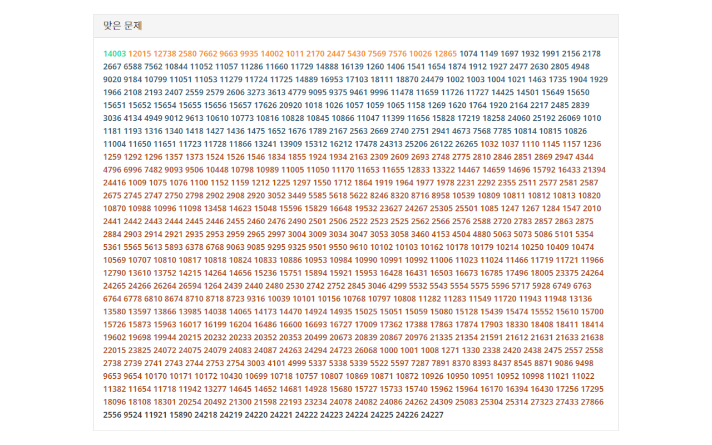

# [TIERIMNIDA](https://github.com/mazassumnida/tierimnida) 클론

## 소개

[백준 온라인 저지](https://www.acmicpc.net) 문제 번호에 [solved.ac](https://solved.ac) 티어 색을 칠해주는 크롬 확장 프로그램

## 미리 보기

## 이용 방법

확장 프로그램 아이콘을 클릭하면 난이도순 정렬을 토글합니다.

### 크롬 웹 스토어

### 직접 설치하기

1. [TIERIMNIDA 클론](https://github.com/yehwankim23/tierimnida-clone/releases/download/v1.1.3.2306/TIERIMNIDA_Clone_1.1.3.2306.zip)을 다운로드하고 압축 해제한다.
2. 크롬 확장 프로그램 탭(`chrome://extensions`) 우측 상단에서 `개발자 모드`를 활성화시킨다.
3. `압축해제된 확장 프로그램을 로드합니다.`를 클릭하고 압축 해제한 폴더를 선택한다.
